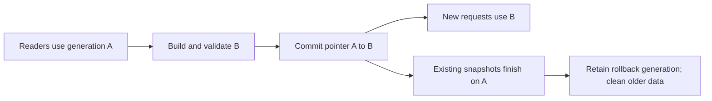

# Durable fix for refresh-related indexer 503s

Status: implementation plan, 29 September 2026. Production inspection for this
plan was read-only. This document covers the database lock failures during trait
publication. The independently reproduced marketplace pagination 500 has its own
cause investigation and acceptance criteria.

## 1. Decision and evidence

Store successive trait/search snapshots as generations in stable PostgreSQL
tables. Build and validate the next generation while readers use the current
one. Publish it by updating one pointer row in a short transaction. Preserve the
previous generation for existing reads and rollback.

The observed failure was a lock timeout reading `metadata.token_search` at
03:03:29 UTC, followed by two collector statement timeouts. The refresh currently
renames search, trait, and revision tables at the end of its build transaction.
The marketplace keeps source transactions open for up to 90 seconds; inspection
found two such transactions holding `AccessShareLock` on the affected relations.
That is a concrete source of conflict with the rename, although we did not
capture the exact blocking process at 03:03.

PostgreSQL's exclusive table locks conflict with ordinary reads. Ordinary
inserts, deletes, and pointer-row updates allow those reads to continue under
MVCC. This is the basis for the proposed design. See the PostgreSQL 16
[locking documentation](https://www.postgresql.org/docs/16/explicit-locking.html).

### Invariants

- A reader uses one complete generation for search scores, traits, revisions,
  facets, and facet status within a request or retained marketplace snapshot.
- A failed or incomplete build cannot become active. The last successful
  generation remains readable while the worker recovers.
- Routine build, publication, and cleanup issue no table renames, drops,
  truncates, view replacements, or other schema changes on reader relations.
- Current ownership, visibility, lifecycle, mint-anchor, metadata-release, and
  content-hash checks keep their existing semantics.
- Publication does not wait for a marketplace snapshot to expire.
- Cleanup cannot remove the active generation or the designated rollback
  generation, and it cannot race with publication or rollback.

The durable path does not require increasing API timeouts or shortening the
marketplace's pagination lifetime. Optional request retries can be evaluated
afterward; they are not part of the acceptance proof.

## 2. Scope and current storage

The following five relations form one generation:

| Existing relation | Proposed stable relation | Identity within a generation |
| --- | --- | --- |
| `metadata.token_search` | `metadata_projection.search` | collection, token ID, lifecycle |
| `metadata.token_trait` | `metadata_projection.trait` | collection, token ID, lifecycle, trait type, value |
| `metadata.projection_revision` | `metadata_projection.revision` | collection, token ID, lifecycle |
| `metadata.trait_facet` | `metadata_projection.facet` | scope, trait type |
| `metadata.trait_facet_status` | `metadata_projection.facet_status` | scope |

Measurements from the production catalog on 29 September:

| Relation | Table and index bytes | Estimated rows |
| --- | ---: | ---: |
| Search | 2.39 GB | 1,072,868 |
| Traits | 4.26 GB | 11,813,133 |
| Revision | 0.20 GB | 1,072,868 |
| Facets and status | Under 1 MB | 305 facets / 15 scopes |

One existing generation therefore occupies about 6.85 GB. These are catalog
estimates and decimal GB, not a forecast for the new layout. Search currently has
many duplicate index definitions. Define a canonical index set for the new
tables instead of copying indexes with `LIKE INCLUDING ALL`.

`leaderboard.wallet_stats` already publishes through transactional row changes;
its refresh stays separate. Record the trait generation used as provenance where
useful, and keep the existing leaderboard release checks. Marketplace
`market_catalog_trait` is maintained with metadata publication and has distinct
null-value semantics; it remains a separate source. Chain indexers and the BNB
writer are outside this data-layout change.

## 3. New schema and index design

Add an independently versioned, additive migration for `metadata_projection`:

1. **`generation` registry:** generation ID, format version, source mode,
   metadata release ID, build start/completion/publication timestamps, state,
   validation result, row counts by collection and scope, and failure reason.
   States are `building`, `ready`, `failed`, and `retired`; the active pointer
   determines which ready generation readers use.
2. **`active` singleton:** current generation ID and previous generation ID,
   with foreign keys to the registry. Only validated, compatible ready
   generations may be selected by the publication operation.
3. **Five payload tables:** carry `generation_id` plus the existing columns.
   Prefix primary keys with the generation ID. Published payload is immutable;
   only retired payload can be deleted. Do not use cascading deletes for a
   generation containing millions of rows.
4. **Migration ownership and grants:** the migration role owns these objects.
   Runtime readers receive SELECT; the refresh and cleanup roles receive only
   the required data permissions. Runtime publication must work without schema
   ownership or CREATE/ALTER/DROP privileges on these relations.

Initial index families:

- Search identity: `(generation_id, collection, token_id, lifecycle)`.
- Search metadata filters: generation, collection, availability, numeric token ID.
- Search rarity orders: generation followed by the existing collection-specific
  and combined-chain sort/tie-break columns. Preserve raw/capped scores and
  NULL ordering. Keep only the partial and non-partial variants justified by
  measured query plans.
- Trait filters: generation, collection, trait type, value, token ID, lifecycle;
  a generation-prefixed numeric-trait index where current queries require it.
- Revision identity and facet/status identities include generation ID.

Use explicit schema definitions and versioned index names. Each query binds a
generation ID as a parameter so PostgreSQL can limit work to that generation.
Check estimates, prepared statements, combined-chain sorts, and FDW predicate
pushdown against production-size data before freezing the index set.

These are ordinary stable tables. Partition attach/detach and replacing an
"active" view on every refresh would introduce schema operations into the same
publication path we are removing.

## 4. Worker lifecycle

Refactor `refreshTraitIndex()` into build, validate, publish, and cleanup stages.

### Build and validate

1. Acquire the existing trait-refresh singleton lock and shared chain-recovery
   lock. Check the storage budget before allocating a generation.
2. Register a unique `building` generation. Retain the existing source-readiness
   checks and capture the metadata release, source mode, and build format.
3. In a repeatable-read transaction, populate all five payload tables for that
   generation. Compute facets from that generation's trait/search rows, using the
   same source snapshot and collection scopes as today.
4. Commit the payload while it is still unpublished. Validate identities,
   collection coverage, all 15 scopes, search/revision correspondence, facet
   totals, and release provenance. Normal token growth is allowed; counts must
   agree with the captured source snapshot rather than a hard-coded row count.
5. Analyze and vacuum the new data before publication so the first request does
   not encounter missing statistics or visibility information. Bound maintenance
   time and I/O; a failed readiness/performance check leaves the old generation
   active. Mark the validated generation `ready`.

A worker crash before payload commit leaves no partial published data. A crash
after payload commit leaves an unused generation that can be validated again or
retired. Recovery must establish that the former worker no longer holds the
singleton lock before claiming its unfinished generation.

### Publish

In a short transaction:

1. Lock the active pointer row for competing publication/cleanup operations.
   Ordinary readers select it without row-lock clauses.
2. Verify that the candidate is ready, its format is supported, and the active
   metadata release still matches. Check the expected predecessor generation to
   reject a stale publisher. Keep the shared recovery guard through this step.
3. Update the current/previous generation IDs and publication timestamps.
4. Update `metadata.derived_snapshot` for `traits` in the same transaction, so
   existing release-status reporting agrees with the new pointer.
5. Commit. The target is a publication transaction below 100 ms in rehearsal;
   define a short lock/statement budget for this transaction only. A budget
   failure leaves the prior pointer in place and permits a bounded later retry.

No table data is copied in the publication transaction. If the client loses its
connection during commit, inspect the pointer by generation ID before retrying.
Do not infer a failed commit from a lost response.

## 5. Reader changes and consistency

### Main indexer API and collector API

- Introduce a typed projection context containing generation ID, release ID,
  format, and publication time. Select it once per logical request.
- Pass that context into the search/trait/revision relation builders in
  `lib/metadata/read-source.ts`. Every derived-data join uses the same generation
  ID, including revision/hash validation.
- The main API runs page and count queries on separate pool connections today.
  Bind the captured generation to both; include it and the release in count-cache
  keys. Keep the existing ownership/visibility cache invalidation rules.
- Read facet values, status, and freshness from that same generation. Avoid a
  mixture of new facets and old search scores when publication happens mid-request.
- Collector requests use one projection context within their existing read
  transaction. Preserve the current query budget and cursor contract. Its live
  pagination behavior across requests remains as currently defined; publication
  alone must not introduce a new cursor-reset response.
- Request-local generation IDs stay valid for the maximum request lifetime plus
  a generous cleanup grace period. Do not keep an indefinitely cached process-wide
  pointer. Absence of an initial valid generation is a readiness failure during
  deployment, not a recurring fallback to partially built data.

### Marketplace catalog

- Add the projection generation ID to the existing retained `Generation` object
  in `src/reads/catalog.ts`.
- Resolve it within the source transaction whose snapshot is exported, then
  import that snapshot into both query lanes. Pass the same generation to all
  catalog count/page SQL that uses search scores.
- Existing marketplace snapshots continue using their original generation when
  the active pointer changes. New snapshots pick up the new generation. Keep
  the current 90-second lifetime and the live ownership/visibility rechecks.
- Update direct-source readiness/grants and the supported FDW mappings/query
  path. Test that the generation predicate is applied at the source. A replica
  or FDW connection must not read a pointer from one source and payload from
  another snapshot/source.
- Keep the metadata-maintained marketplace trait relation and its JSON/null
  handling intact. Only its search-score dependency moves to the new storage.

PostgreSQL repeatable-read transactions preserve their earlier snapshot while
new transactions see committed publication changes. The payload must commit
before the pointer can reference it. See
[transaction isolation](https://www.postgresql.org/docs/16/transaction-iso.html).

## 6. Cleanup and capacity controls

Retain the active generation, one complete rollback generation, and at most one
build in progress. Every superseded generation also receives at least 15 minutes
of grace from supersession; confirm this exceeds all configured non-transactional
request lifetimes. Marketplace transactions remain protected by PostgreSQL MVCC
while they are open.

Cleanup is a resumable job:

1. Under the same short publication/retirement coordination lock, claim an
   eligible generation as retired. Recheck current and rollback pointers there.
   Publication/rollback must reject a retired generation.
2. Delete only that generation's payload in bounded key-range batches, committing
   between batches. Start around 10,000 rows per batch and tune to a measured
   per-batch latency/I/O budget on the clone.
3. Remove or compact its registry record only after all payload rows are gone.
   Preserve a small audit record of publication, retirement, counts, and reason.
4. Vacuum with `TRUNCATE FALSE`. Set `vacuum_truncate=false` on the new tables
   and their applicable TOAST storage at creation so autovacuum cannot reintroduce
   exclusive tail-truncation locks. Regular vacuum reuses space inside the files;
   capacity calculations must not assume that file sizes immediately shrink.

PostgreSQL documents that vacuum tail truncation requires an exclusive lock;
the table setting also applies to autovacuum. See
[table storage settings](https://www.postgresql.org/docs/16/sql-createtable.html)
and [VACUUM](https://www.postgresql.org/docs/16/sql-vacuum.html).

Monitor generation count/bytes, dead tuples, oldest transaction age, cleanup
progress, WAL growth, temporary files, and free disk. If cleanup or storage falls
behind, defer the next build and keep serving the active generation. Alert on
staleness; do not delete protected data to make a build fit.

**Capacity gate:** the host had about 98.4 GB free at inspection. Three generations
at today's size are already about 20.5 GB before new key/index overhead, dead
tuples, WAL, legacy rollback tables, and temporary work. The MongoDB backup
recently needed roughly 53 GB of local dump plus its compressed archive. Measure
the combined peak and retain at least the existing 25 GB reserve. Resolve that
backup's local-storage overlap or add capacity before production activation.
Place a full restored rehearsal database on a separate host/storage unless the
same combined-peak calculation proves it fits.

## 7. Work packages and files

Deliver these as incremental, reviewable changes:

| Package | Main files / deliverable | Exit condition |
| --- | --- | --- |
| 1. Schema and inventory | New `lib/metadata/projection-schema.ts`, additive migration/seed/check scripts, measured consumer and disk inventory | New objects and least-privilege grants work on PostgreSQL 16; existing routes still work |
| 2. Writer and cleanup | Refactor `lib/leaderboard/refresh.ts`; new projection build/publish/retire modules | Validated generation publication, crash recovery, race-safe cleanup, no runtime schema operations |
| 3. Indexer readers | `lib/metadata/read-source.ts`, `lib/api/server.ts`, collector query/routes, exact-count cache | All derived reads bind one generation; parity and deadline tests pass |
| 4. Marketplace readers | `src/reads/catalog.ts`, `catalogQuery.ts`, readiness/grant/FDW scripts | Retained catalog snapshots survive publication and read the same generation in both lanes |
| 5. Operations and recovery | Worker configuration, migrate/refresh/recovery/verify scripts, backup coverage, rollout and rollback commands | Every scheduled/operator refresh path uses the selected storage mode; recovery can rebuild a valid active generation |
| 6. Rehearsal and rollout | Concurrent PostgreSQL tests, full-data report, deployment record | Acceptance gates below pass before production completion is claimed |

Use explicit `legacy` and `generation` read/write modes during transition, with
readiness checks for each. Resolve flags centrally. Startup migrations must not
re-run old index/schema operations against an active projection. Audit the
one-off metadata recovery scripts: they currently reference old tables directly
and must either use the new projection APIs or enforce their isolated recovery
database requirement.

Build marketplace changes on its actual deployed revision, including subsequent
production fixes. Reconcile that with this branch before creating the release;
do not accidentally deploy an older marketplace artifact as part of this change.

## 8. Tests and acceptance

Use real PostgreSQL 16 for concurrency tests; an in-memory SQL substitute cannot
establish lock behavior.

### Required correctness tests

- Every route sees all five tables from generation A or all from B during a
  publish. Counts and page results do not mix generations, and caches do not
  return A's count for B.
- Publication preserves metadata-release, content-hash, lifecycle, ownership,
  visibility, rarity order/NULL, and cross-chain token-ID collision semantics.
- Old collector cursors and marketplace cursor/snapshot pairs keep their
  supported behavior after publication.
- A missing scope, mismatched revision, wrong release, or failed validation
  rejects publication. A second worker cannot compete for the build.
- Inject crashes during build, after payload commit, during publication, after
  successful commit with a lost response, and midway through cleanup. The
  active generation remains complete and recovery is idempotent.
- Race cleanup against publication and rollback. Neither active nor protected
  previous data can be claimed/deleted.
- A metadata-release change between build and publication rejects the stale
  candidate. Existing source-validity checks still reject outdated bindings.
- Backup/restore the new schema and rebuild a generation on the isolated clone.

### Required concurrency test

1. Open an actual marketplace catalog snapshot and exercise its source lanes so
   it holds read locks; retain it for its full 90-second lifetime.
2. Run parallel main API, collector, facet, and catalog reads at measured peak
   concurrency, then at twice that level while remaining within intended limits.
3. Publish at least three prepared generations and run cleanup under that load.
   Include a separate complete production-size build to measure I/O effects.
4. Verify old marketplace pages remain on their original generation and new
   requests use the latest one.
5. Record route latency/error rates and lock evidence with `pg_blocking_pids`
   and `pg_locks`. Attribute resource/timeouts separately from intentional
   readiness or rate-limit responses.

Pass conditions:

- Zero refresh-induced 503s or lock-timeout errors during the test.
- Publication finishes while the 90-second snapshot is still open.
- No routine writer/cleanup statement requests an exclusive table lock on any
  reader relation; inspect SQL paths as well as sampled locks.
- Target publication p99 below 100 ms; API p95 at most the larger of 1.2 times
  baseline and baseline plus 50 ms. Collector SQL p99 stays below its existing
  one-second deadline. These are proposed gates to validate on the clone.
- Exact parity for the chosen baseline request set; no skipped rows or changed
  sort/filter semantics caused by the generation selection.
- Repeated build/cleanup cycles reach a bounded storage footprint and preserve
  the 25 GB production reserve under the measured backup/storage budget.

The known deep-pagination 500 remains an explicitly tracked independent failure.
It must not be counted as proof that this lock fix failed, or hidden in a claim
that the entire marketplace has zero errors.

## 9. Production sequence and rollback

1. Finish the capacity prerequisite. Take a fresh protected backup including
   database globals, schema/data, grants, runtime/configuration, and restore
   instructions. Verify the encrypted Storage Box copy through download and
   checksum comparison, as in the monorepo cutover.
2. Rehearse migration, seeding, reader switches, a full refresh, concurrent
   publication/cleanup, and rollback on an isolated restored database. Use a
   baseline dataset that includes the current marketplace reader configuration.
3. Install new tables/indexes/grants alongside the existing objects. Deploy a
   compatibility release that supports both storage modes, initially in legacy
   mode. Preserve this release as the tested code-rollback target.
4. Pause the old trait worker after a completed cycle. In one consistent source
   snapshot, seed the new generation from all five existing relations and their
   trait-release record. Validate row/value parity and make this seed active.
   The APIs continue reading the existing published data during seeding.
5. Switch the main API, collector, and marketplace readers in stages to generation
   mode, checking routes, privileges, source snapshots, and query plans after
   each. Keep the trait writer paused until every affected reader is confirmed.
6. Enable the generation writer and perform its first full refresh. Capture
   continuous reads through publication. Retire all scheduled commands that can
   launch the old rename/drop refresh. Confirm the installed unit/entrypoint and
   mode before re-enabling its schedule.
7. Observe at least three full refresh cycles and 24 hours, including a controlled
   backup overlap within the agreed capacity budget. Accept only after the
   concurrency, freshness, latency, and storage gates pass.
8. Remove obsolete legacy tables/indexes in a separate maintenance change after
   dependent-reader and rollback-retention checks. Their removal is outside the
   routine refresh process.

### Rollback rules

- For a bad derived generation, pause publication and atomically select the
  protected previous ready generation after verifying its release/format. Roll
  the trait release-status row back in the same transaction. Canonical chain
  state and user visibility writes remain live.
- For a code regression, deploy the tested compatibility release that understands
  generation storage. This avoids coupling rollback to an obsolete table layout.
- During the initial paused/seeded switch, legacy mode is an additional escape
  route. Once generation refreshes have advanced, the old tables are stale; check
  their age and rebuild/validate them before any later legacy-reader rollback.
- The old rename/drop worker must never be restarted automatically as a rollback
  step. A full database restore is reserved for a separate corruption recovery
  procedure, with later writes reconciled.

## 10. Completion definition

Normal refreshes publish through the generation pointer; every affected reader
uses the new storage; marketplace snapshots survive publication; cleanup and
backups fit the storage budget; restore and rollback have been exercised; and
the production observation period shows no 503s attributable to refresh locks.

Deliver the schema/version manifest, grants, tested release/configuration,
parity and load reports, backup verification, exact rollback commands, and
production observation record alongside this plan.
